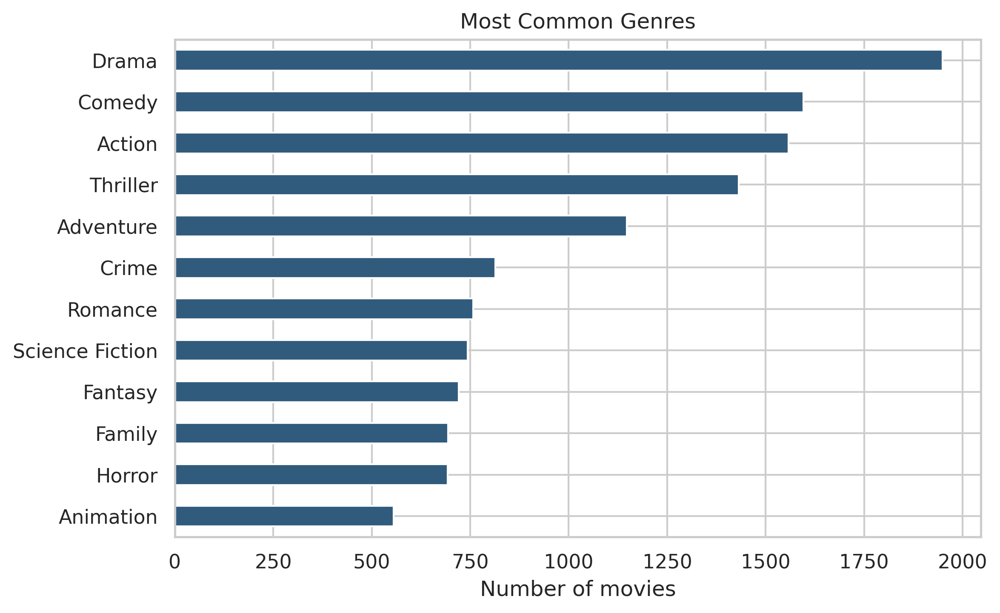
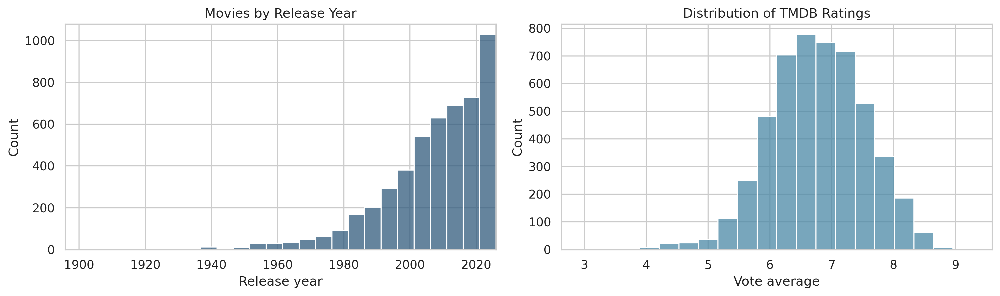
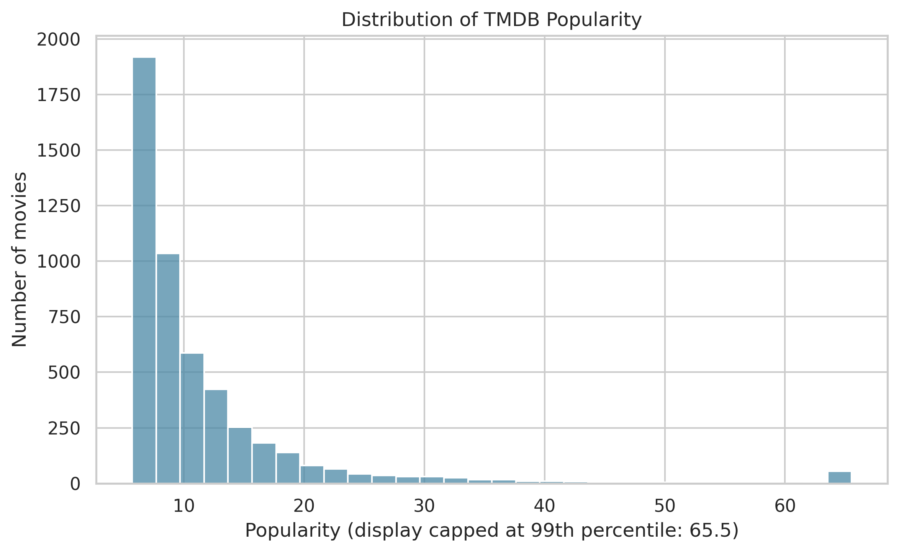
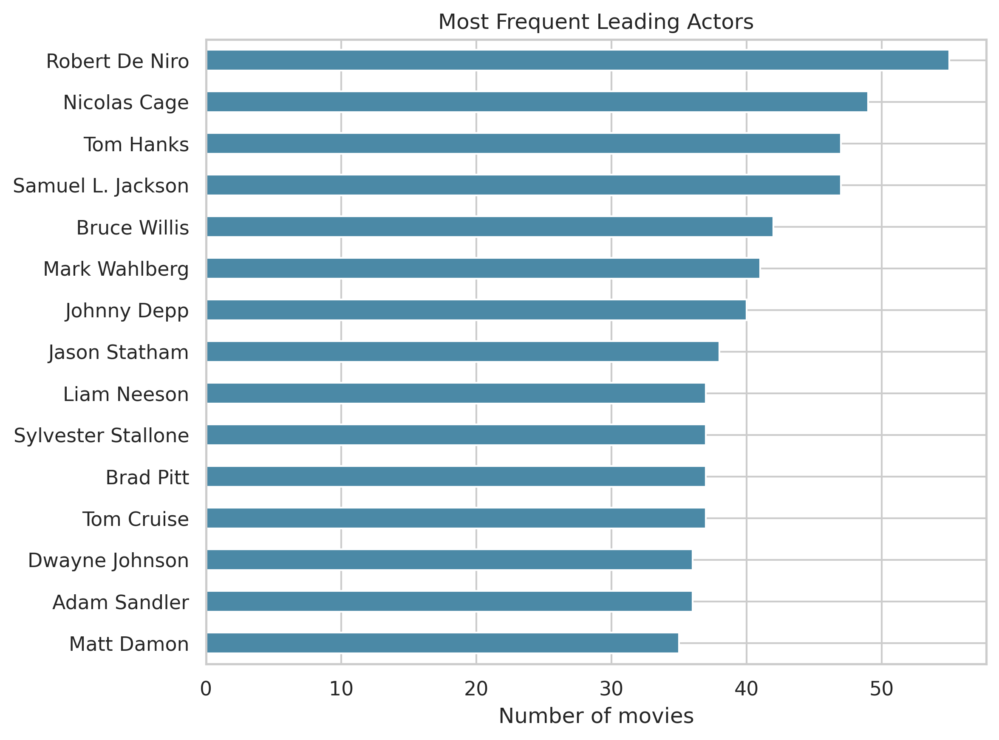
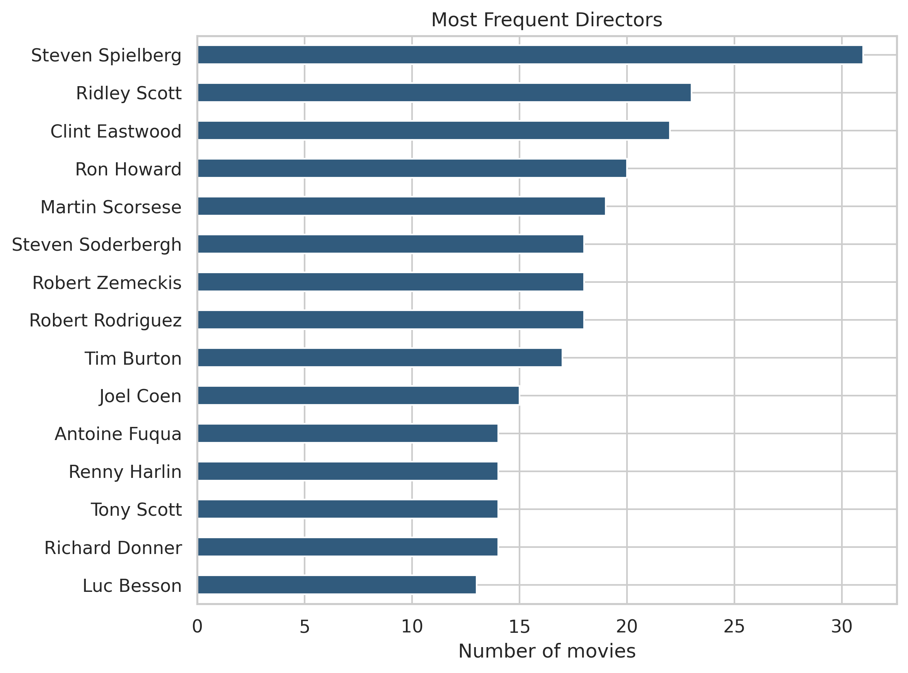

# Project Overview

Movie catalogs can be difficult to explore when users know one title they enjoy but do not know what to watch next. I built a content-based recommendation system that finds similar movies using plot descriptions and structured metadata from **The Movie Database (TMDB)**.

The final catalog contains **5,000 unique movies**. For each title, I combined its overview, tagline, genres, keywords, director, and leading cast. I compared weighted TF-IDF—a **5,000 x 15,000 sparse feature matrix**—with `all-MiniLM-L6-v2` sentence embeddings, using cosine similarity to rank the movies most closely aligned with a selected title.

Both methods were evaluated on the same 100 sampled movies and their top 10 recommendations. Embeddings produced slightly higher broad genre overlap (**92.3% versus 90.3%**), but TF-IDF performed better on genre-set agreement, keyword, director, and cast overlap, recommendation diversity, and explainability. **TF-IDF was therefore retained as the final deployed method.**

## Application Demo and Live App

Watch this short demo first for a quick look at the movie search, selected-title details, adjustable recommendation count, recommendation cards, and similarity explanations.

<video controls playsinline preload="metadata" width="100%" style="max-width: 960px; border-radius: 8px;">
  <source src="../videos/projects/movie-recommender/movie-recommender-app-demo.mp4" type="video/mp4">
  Your browser does not support embedded video. You can
  <a href="../videos/projects/movie-recommender/movie-recommender-app-demo.mp4">open the demonstration video directly</a>.
</video>

::: {.callout-note title="Try the Live Application"}
Want to explore the recommender yourself? Open the live app below. Because it is hosted on Render, it may take approximately **1–2 minutes to start** after a period of inactivity.

[Open Live App](https://tmdb-movie-recommender-app.onrender.com/){.btn .btn-primary target="_blank"}
:::

## Application Highlights

- **Searchable catalog:** Find a title from the saved catalog of 5,000 movies.
- **Adjustable results:** Display five to fifteen recommendations for the selected movie.
- **Recommendation context:** Show similarity scores and shared genres, directors, or themes.
- **Movie details:** Review posters, release years, plot summaries, ratings, genres, keywords, directors, and cast.

# Project Scope

| Project element | Final scope |
|:--|:--|
| Recommendation type | Content-based, movie-to-movie similarity |
| Catalog | 5,000 unique TMDB movies |
| Content features | Overview, tagline, genres, keywords, director, and leading cast |
| Text representation | Weighted TF-IDF compared with `all-MiniLM-L6-v2` sentence embeddings |
| Ranking method | Cosine similarity |
| Evaluation | Six content-consistency and diversity diagnostics across the same 100 seed movies, plus manual review |
| Application | Streamlit deployed on Render |

::: {.callout-important}
**Similarity is not a predicted user rating or probability of enjoyment.** It measures alignment between movie-content vectors. Because the dataset does not contain individual user histories, the system recommends similar content rather than personalized preferences.
:::

# Exploratory Insights

## Genre Coverage

Drama is the most common genre in the 5,000-movie catalog, followed by Comedy and Action. Because some genres appear much more often than others, I evaluated recommendations with several content-overlap and diversity measures rather than relying on genre overlap alone.

{fig-alt="Horizontal bar chart showing Drama as the most common genre, followed by Comedy and Action." fig-align="center" width="90%"}

## Release Years and Ratings

The catalog spans more than a century, but it contains many more recent movies, especially titles released after 2000. TMDB ratings are concentrated around 6 to 7, while very low or very high averages are uncommon. Ratings describe audience response and are displayed in the app, but they are not used to calculate content similarity.

{fig-alt="Two histograms showing that the catalog contains more recent releases and that most TMDB vote averages fall between 6 and 7.5." fig-align="center" width="95%"}

## Popularity Distribution

TMDB popularity is strongly right-skewed: most movies have modest popularity scores, while a small group attracts much more attention. The chart is capped at the 99th percentile so the main distribution remains visible. Popularity was not included in the similarity features, preventing blockbuster status from automatically determining recommendations.

{fig-alt="Right-skewed histogram of TMDB popularity scores, displayed through the 99th percentile." fig-align="center" width="90%"}

## Frequent Cast and Directors

Robert De Niro, Nicolas Cage, Tom Hanks, and Samuel L. Jackson are among the most frequent leading actors in the catalog. Cast information helps the system recognize related films and recurring collaborations when it is relevant to a selected title.

{fig-alt="Horizontal bar chart showing Robert De Niro, Nicolas Cage, Tom Hanks, and Samuel L. Jackson among the most frequent leading actors." fig-align="center" width="90%"}

Steven Spielberg appears most often among the listed directors, followed by Ridley Scott and Clint Eastwood. Director information was intentionally given additional weight in the TF-IDF movie profiles because directorial style can be a meaningful signal of content similarity.

{fig-alt="Horizontal bar chart showing Steven Spielberg, Ridley Scott, and Clint Eastwood as the most frequent directors." fig-align="center" width="90%"}

# Data and Recommendation Design

## Data Source

| Source | Contribution |
|:--|:--|
| TMDB movie endpoints | Titles, release dates, plot summaries, taglines, ratings, and poster paths |
| TMDB genre metadata | Genre labels used as recommendation features and for diagnostic evaluation |
| TMDB keywords and credits | Themes, directors, and leading cast used to enrich movie profiles |

The data pipeline cleaned text fields, standardized multi-value metadata, removed duplicate movie IDs, and created compact tokens for names and categories. Genres and directors were intentionally repeated in the combined content to give them greater influence in the final similarity ranking.

## TF-IDF, Sentence Embeddings, and Cosine Similarity

TF-IDF assigns higher weights to terms that are informative for a movie but less common across the full catalog. This reduces the influence of generic words while preserving distinctive plots, themes, people, and genres.

Sentence embeddings represent each movie as a dense 384-value vector and can recognize related meaning even when descriptions use different words. Both methods used the same 5,000-movie candidate catalog and the same underlying movie information for a fair comparison.

Cosine similarity then compares the direction of two TF-IDF vectors. For each selected movie, the application:

1. Locates the movie's saved TF-IDF vector.
2. Compares it with all 5,000 catalog vectors.
3. Removes the selected movie itself from the ranking.
4. Returns the highest-scoring titles in descending order.

The selected sparse matrix and cleaned movie catalog were saved as a compact Joblib artifact, allowing the deployed application to return recommendations without calling the TMDB API or running the embedding model at runtime.

# Evaluation

## TF-IDF and Embeddings Comparison

Both methods were evaluated on the same 100 sampled source movies and 10 recommendations per source.

| Diagnostic | TF-IDF | Embeddings |
|:--|--:|--:|
| At least one shared genre | 90.3% | **92.3%** |
| Mean genre Jaccard similarity | **48.9%** | 47.6% |
| At least one shared keyword | **57.0%** | 51.6% |
| Same director | **29.5%** | 5.3% |
| At least one shared cast member | **15.5%** | 10.4% |
| Unique recommendation rate | **88.5%** | 80.2% |

These results are content-consistency diagnostics, not classification accuracy or the probability that a user will enjoy a recommendation. Embeddings performed best only on the broad shared-genre measure; TF-IDF was stronger across the remaining diagnostics and produced clearer metadata-based explanations.

Examples of strong relationships included franchise and character matches for *The Dark Knight*, sequel relationships for *The Avengers* and *Inside Out*, and similar psychological-thriller recommendations for *Gone Girl*. Weaker examples showed the limitation of relying on shared vocabulary and metadata without user-feedback signals.

# Technologies

- **Data collection and analysis:** Python, Pandas, NumPy, TMDB API
- **Recommendation system:** Scikit-learn, TF-IDF, cosine similarity, Sentence Transformers, SciPy, Joblib
- **Application:** Streamlit
- **Deployment and reproducibility:** Render, Git, GitHub, automated tests

# Limitations and Next Steps

The system recommends movies that resemble a selected title, but it does not learn an individual user's preferences. Recommendation quality depends on the completeness of TMDB descriptions and metadata, and the manual weighting of genres and directors can favor franchises or closely related titles. The deployed catalog is also limited to the 5,000 movies saved during data collection.

A future version could collect user likes, ratings, or clicks and combine them with content similarity in a hybrid recommender. Diversity controls could also reduce repetitive franchise recommendations. Evaluation with real user feedback would be necessary to measure satisfaction and ranking quality.

# Final Takeaway

This project demonstrates the complete path from API-based data collection and text-feature engineering through model comparison, evaluation, and deployment. The final system provides fast, explainable movie-to-movie recommendations while showing why a simpler TF-IDF model can remain the stronger deployment choice after comparison with sentence embeddings.
