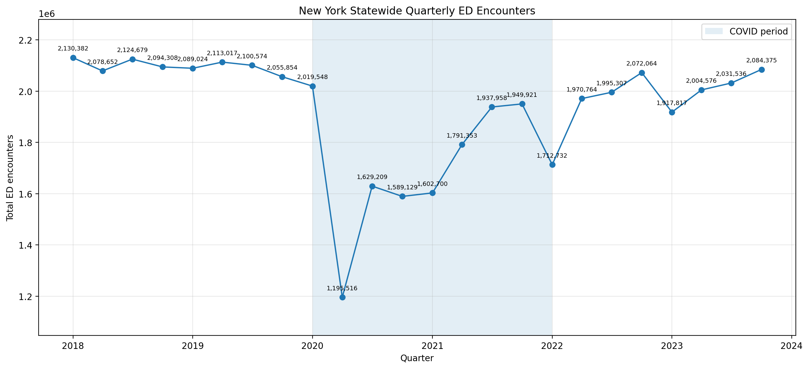
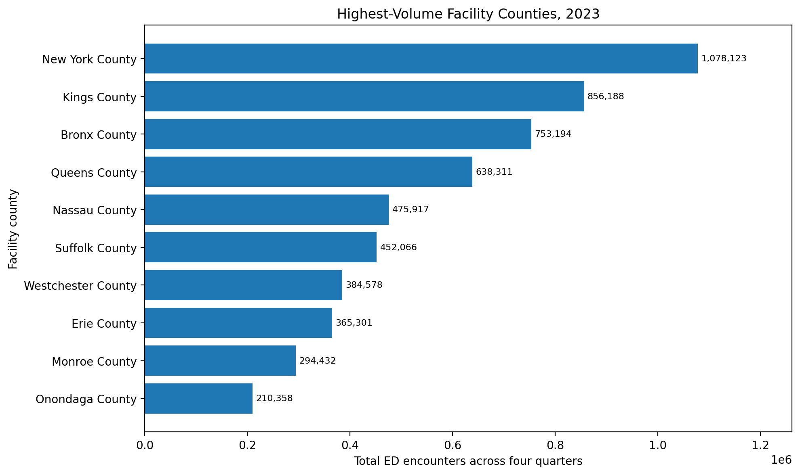
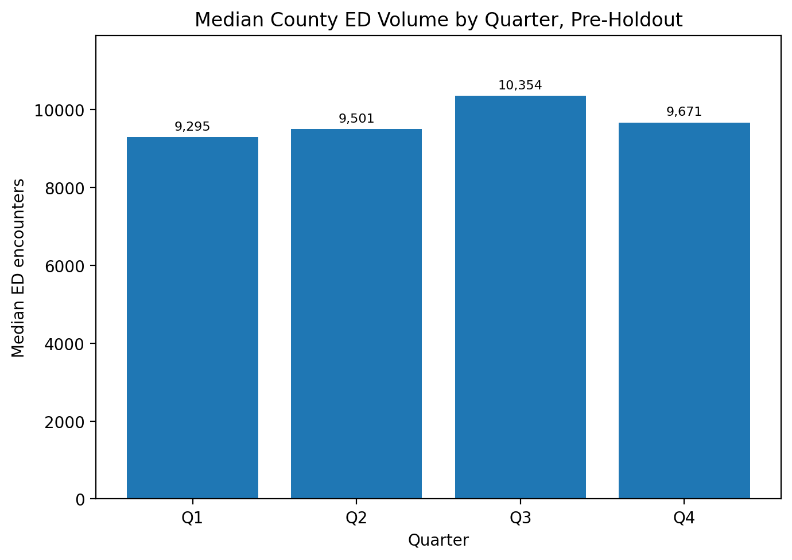
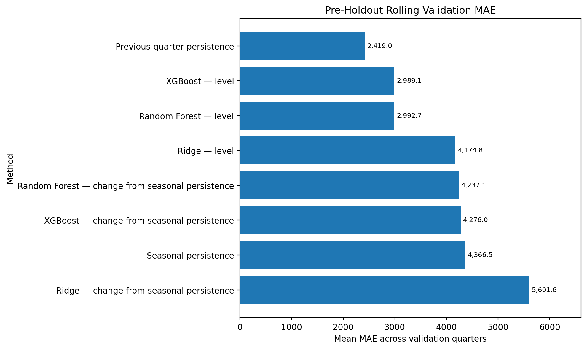
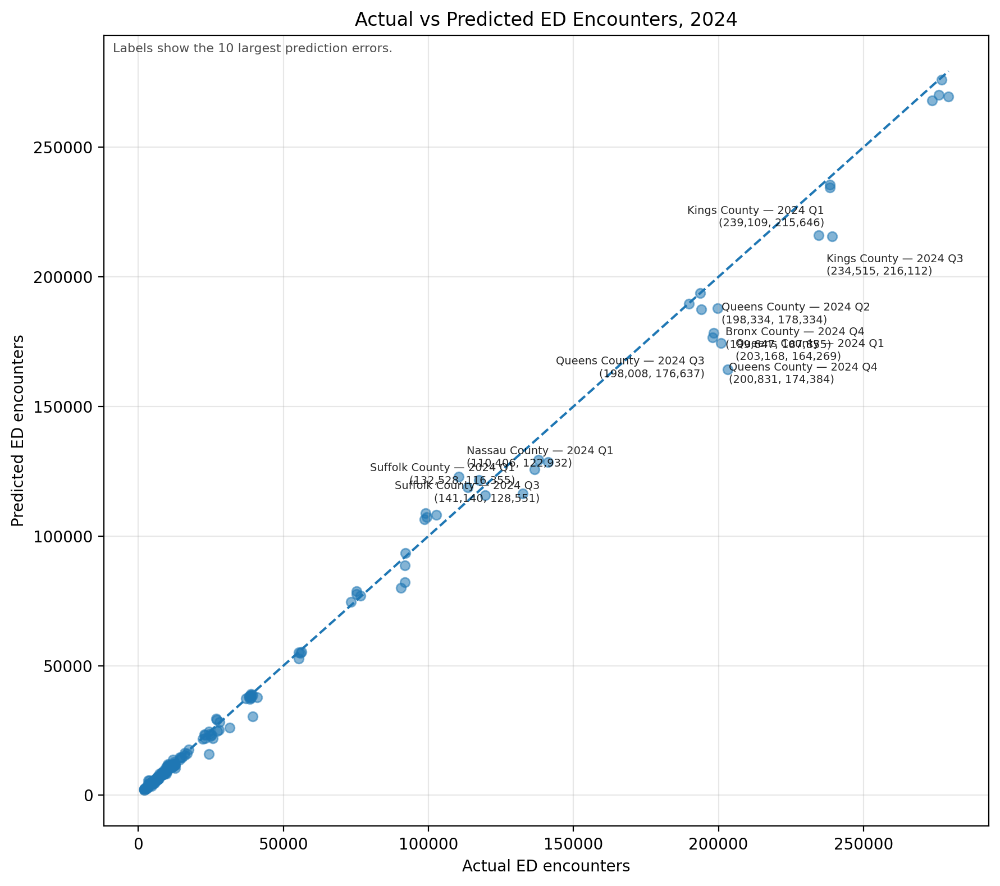
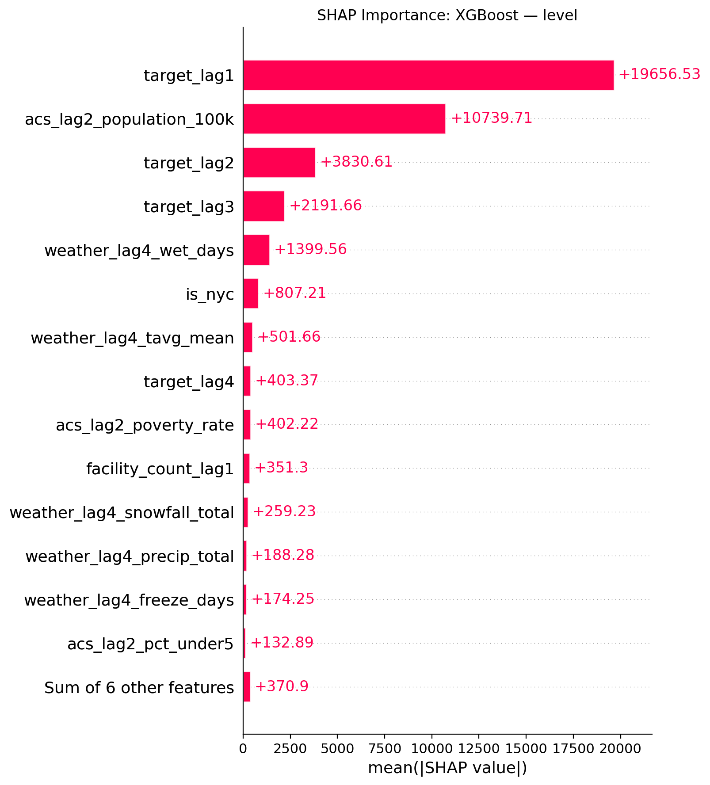

# Project Overview

Emergency departments need reliable demand estimates to support staffing and capacity-planning discussions. For my DATA 975 capstone, I built a reproducible forecasting pipeline and Flask application for total emergency department encounters by **New York facility county and quarter**.

The analysis covers **1,536 county-quarter observations**, **57 facility counties**, and **28 quarters from 2018 Q1 through 2024 Q4**. I evaluated machine-learning models against transparent forecasting benchmarks using chronological validation and a locked 2024 holdout.

The key result was that **previous-quarter persistence outperformed tuned XGBoost and seasonal persistence**. It achieved a 2024 holdout MAE of **1,253 encounters** and WAPE of **3.36%**. The application therefore uses persistence for its one-quarter-ahead prototype and retains XGBoost for historical evaluation and diagnostics.

## Application Demo and Live App

Watch this short demo first for a quick look at the county and period selection, forecast generation, historical comparison, multi-county evaluation, and result interpretation.

<video controls playsinline preload="metadata" width="100%" style="max-width: 960px; border-radius: 8px;">
  <source src="../videos/projects/ed-demand/ed-demand-app-demo.mp4" type="video/mp4">
  Your browser does not support embedded video. You can
  <a href="../videos/projects/ed-demand/ed-demand-app-demo.mp4">open the demonstration video directly</a>.
</video>

::: {.callout-note title="Try the Live Application"}
Want to explore the forecasting prototype yourself? Open the live app below. Because it is hosted on Render, it may take approximately **1–2 minutes to start** after a period of inactivity.

[Open Live App](https://ny-quarterly-ed-demand-app.onrender.com/){.btn .btn-primary target="_blank"}

[View Presentation](../files/ED_Demand_ThiThanhHienBui_Emi_Final.pdf){.btn .btn-outline-secondary target="_blank"}
:::

## Application Highlights

- **Prototype forecast:** Generate a one-quarter-ahead estimate using the recommended persistence method.
- **Historical result:** Compare observed demand with XGBoost and both persistence benchmarks.
- **Multi-county evaluation:** Compare XGBoost and previous-quarter persistence across two to ten selected counties.
- **Clear interpretation:** Distinguish retrospective evaluation from a live current-quarter forecast.

# Project Scope

| Project element | Final scope |
|:--|:--|
| Unit of analysis | One New York facility county-quarter |
| Target | Total ED encounters |
| Full analysis period | 2018 Q1-2024 Q4 |
| Deployed model-ready panel | 2019 Q1-2024 Q4 |
| Coverage | 57 facility counties; 1,536 analysis rows |
| Final holdout | 2024 Q1-Q4 |
| Selected ML model | Tuned XGBoost - level |
| Recommended method | Previous-quarter persistence |
| Purpose | Retrospective public-data planning prototype |

::: {.callout-important}
**Facility county is not necessarily the patient's county of residence.** The target represents encounters reported by facilities located within a county, so this project supports facility-location planning rather than resident-level utilization analysis.
:::

# Exploratory Insights

## Statewide Demand Through the COVID Disruption

Quarterly statewide encounters were relatively stable near 2.1 million before 2020, then fell sharply to about 1.19 million in 2020 Q2. Volume recovered gradually and reached about 2.08 million by 2023 Q4, showing why chronological validation and explicit COVID-period handling were necessary.

{fig-alt="Line chart of statewide quarterly emergency department encounters showing a sharp decline in 2020 and recovery through 2023." fig-align="center" width="95%"}

## County Concentration and Seasonality

New York, Kings, and Bronx were the three highest-volume facility counties in 2023, so statewide totals are strongly influenced by a small number of large counties. Median county volume also shows a modest Q3 peak, but this seasonal pattern was not strong enough for seasonal persistence to outperform the previous-quarter benchmark.

::: {layout-ncol=2}
{fig-alt="Horizontal bar chart showing New York, Kings, and Bronx as the highest-volume facility counties in 2023."}

{fig-alt="Bar chart showing the highest pre-holdout median county emergency department volume in quarter three."}
:::

# Data and Forecast Design

## Data Sources

| Source | Contribution |
|:--|:--|
| SPARCS ED Encounters by Facility | Quarterly encounter target aggregated by facility county |
| U.S. Census ACS 5-Year Estimates | Lagged population, income, poverty, and age predictors |
| Open-Meteo Historical Weather | Daily weather aggregated into lagged quarterly conditions |
| U.S. Census Gazetteer | Location and regional indicators |

Exploratory analysis identified a major COVID-era break, recovery in later quarters, concentration in high-volume counties, and a seasonal peak in median Q3 demand. These findings supported chronological evaluation rather than a random train-test split.

## Leakage-Safe Features

I screened 25 candidate predictors and selected 20 using pre-holdout validation. The features included:

- Demand history from the previous one to four quarters
- Lagged facility count
- Lagged demographic and socioeconomic context
- Lagged precipitation, snow, hot-day, wet-day, and freeze-day measures
- Geographic and regional indicators

Expanding training windows used only information available before each forecast quarter. Feature selection and model tuning were completed before the full 2024 holdout was evaluated. Recent demand—especially the previous quarter—was the strongest signal in the XGBoost diagnostics.

# Model Evaluation

## Pre-Holdout Model Selection

Previous-quarter persistence achieved the lowest mean rolling-validation MAE at **2,419 encounters**, ahead of tuned XGBoost and Random Forest at about 2,989 and 2,993. This result was established before opening the locked 2024 holdout and supported using persistence as the operational benchmark.

{fig-alt="Horizontal bar chart showing previous-quarter persistence with the lowest mean rolling-validation MAE." fig-align="center" width="90%"}

## Final 2024 Holdout

| Method | MAE | WAPE | R-squared | Skill |
|:--|--:|--:|--:|--:|
| **Previous-quarter persistence** | **1,253** | **3.36%** | **0.9970** | **0.00** |
| Tuned XGBoost - level | 2,158 | 5.78% | 0.9928 | -0.72 |
| Same-quarter previous-year persistence | 2,841 | 7.61% | 0.9846 | -1.27 |

**MAE** is the average absolute miss in encounter units. **WAPE** expresses total absolute error as a percentage of total observed volume. **Skill** is the relative reduction in MAE compared with previous-quarter persistence: positive skill favors the competing model, while negative skill favors persistence. For example, -0.72 means 72% more MAE than the benchmark.

XGBoost captured the broad volume differences between small and large counties, which explains its high R-squared. However, persistence produced substantially smaller point-by-point errors. This is an important modeling result: the most accurate evaluated method was also transparent and easy for stakeholders to audit.

## XGBoost Diagnostic Views

The 2024 actual-versus-predicted points mostly follow the diagonal, confirming that XGBoost captured the large differences in scale across counties. Its largest misses occurred among high-volume observations, which is why a high R-squared did not translate into the lowest MAE or WAPE.

{fig-alt="Scatter plot of actual versus predicted 2024 emergency department encounters with most points near the diagonal and several larger high-volume errors." fig-align="center" width="90%"}

SHAP analysis shows that the previous quarter's encounter volume was the dominant XGBoost signal, followed by lagged population and older demand lags. Weather and socioeconomic features contributed less, reinforcing the practical strength of the simple persistence benchmark.

{fig-alt="SHAP importance chart showing previous-quarter demand as the strongest XGBoost feature, followed by lagged population and earlier demand lags." fig-align="center" width="90%"}

# Technologies

- **Analysis:** Python, Pandas, NumPy, Scikit-learn, XGBoost, SHAP
- **Data:** SPARCS, U.S. Census ACS, Open-Meteo, Census Gazetteer
- **Application:** Flask, HTML/CSS, Joblib
- **Deployment and reproducibility:** Render, Git, GitHub, automated smoke testing

# Limitations and Next Steps

This is a retrospective prototype built from public quarterly data, not a live hospital operations system. Public suppression may understate totals in affected facility county-quarters, and quarterly aggregation cannot represent daily or hourly arrival peaks. The data also lacks patient acuity, staffed beds, shift coverage, and other hospital-specific constraints.

A production version would require a current internal encounter feed, automated predictor refreshes, performance monitoring, access controls, and stakeholder governance. Hospital-level staffing, capacity, acuity, and arrival-pattern data would be necessary before translating demand forecasts into operational staffing recommendations.

# Final Takeaway

This project demonstrates the full path from public-data integration and leakage-safe forecasting to a deployed stakeholder application. The final recommendation is deliberately evidence-based: **use previous-quarter persistence for the prototype forecast and retain XGBoost for historical evaluation and diagnostics**.
